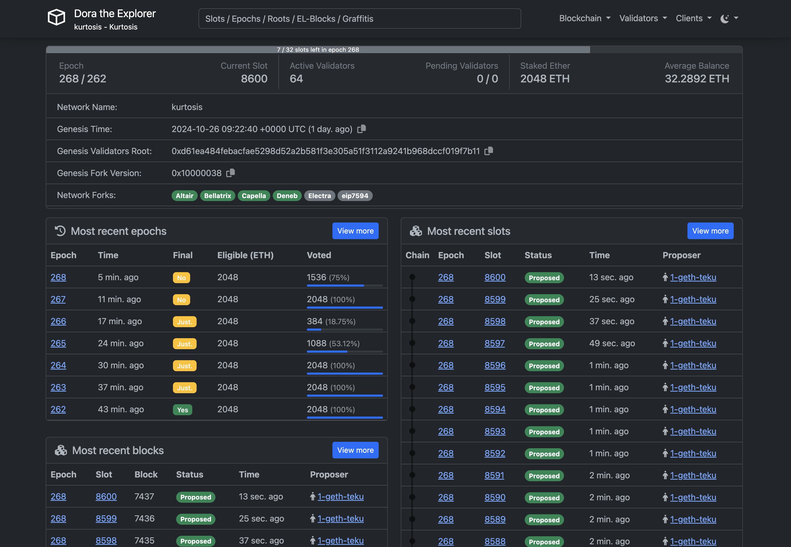
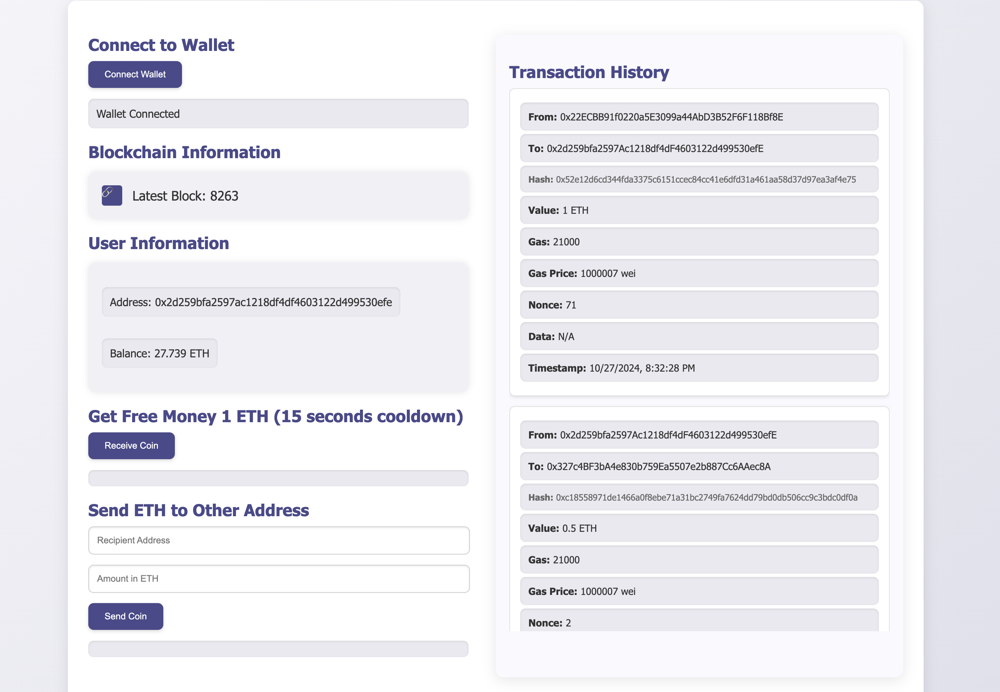

# 架設私有鏈以及使用 Golang 建立 Service

## 前情提要
- 功能說明
    - 架設以太坊私有鏈
    - 使用 Gin 建立 Restful API
        - 取得區塊高度
        - 取得帳戶餘額
        - 取得交易資料
        - 領取 ETH
    - 使用 HTML, CSS, JavaScript 建立前端頁面
        - 連結 WEB3 錢包
        - 顯示區塊高度
        - 顯示帳戶餘額
        - 顯示交易資料
        - 發送 ETH 交易
    - 使用 golang 的 cron 定期同步區塊資料
        - 每 15 秒同步一次當前資料庫所有使用者的交易資料
- 環境需求
    - Docker
    - Kurtosis

## 以下將說明如何架設私有鏈以及建立 Service
官方提供的架設方式有兩種
- 使用 Kurtosis 架設私有鏈
    - 連結：https://geth.ethereum.org/docs/fundamentals/kurtosis
- 使用 Geth 架設私有鏈
    - 連結：https://geth.ethereum.org/docs/fundamentals/private-network

第二種方式官方目前是已經不推薦了，所以這邊會使用第一種方式去架設私有鏈

### 使用 Kurtosis 架設私有鏈
Kurtosis 是一個用於開發、測試和部署分散式系統的工具，能夠輕鬆地建立、管理和運行 Docker 容器。

首先，安裝 Kurtosis，參考官方的[安裝指南](https://docs.kurtosis.com/install)。以下以 Brew (MAC OS) 作為示範：

```bash
brew install kurtosis-tech/tap/kurtosis-cli
```
Homebrew 可能會警告你你的 Xcode 過時或完全缺失。這是 Homebrew 的要求，與 Kurtosis 無關（Kurtosis 作為預構建的二進制文件發送）
- 這個我自己在安裝的時候也有遇到

如果 Homebrew 提示 Xcode 過時或缺失，請運行：

```bash
xcode-select --install
```

## 私有鏈的基本設定
安裝完上述的工具後，就可以開始設定私有鏈，首先先建立一個設定檔 network_params.yml，以下是官方範例的設定

```yaml
# network_params.yml

participants:
  - el_type: geth
    cl_type: lighthouse
    count: 2
  - el_type: geth
    cl_type: teku
network_params:
  network_id: "585858"
additional_services:
  - dora
```
這邊做一個簡易說明如下：
- participants // 設定參與者
    - el_type: geth // 執行層的類型
    - cl_type: lighthouse // 共識層的類型
    - count: 2 // 參與者數量
- network_params // 設定網路參數
- additional_services // 添加額外的服務

特別提一下我覺得有趣的地方，additional_services 這個設定蠻方便的，可以省去我們自己重新刻同步區塊的程式，顯示當前區塊的資料，也就是不需要重新去造輪子，除了 Dora 以外還有其他服務可以選擇，官方的設定檔還是蠻簡易的一個版本，詳細的壓模檔設定可以參照這個[連結](https://github.com/ethpandaops/ethereum-package)

## 使用 Kurtosis 啟動私有鏈
啟動指令：

```bash
kurtosis run github.com/ethpandaops/ethereum-package --args-file ./chain/network_params.yml --image-download always --enclave test-chain
```

備註：可使用 Makefile 簡化指令為 `make run-chain`。

啟動後可以透過 `kurtosis web` 指令可以進到 Kurtosis 的介面，可以方便看到叢集的狀態，以及叢集的資訊，另外如果我們需要查看節點啟動指令跟創始區塊設定，也可以到 Kurtosis 的介面查看

剛剛在上面有提到在設定檔設定 Dora 的話，啟動完後，就可以直接透過瀏覽器進到 Dora 的介面，看到區塊的資訊，以下為 Dora 的介面



# 架設私有鏈總結
以上就是使用 Kurtosis 架設私有鏈的過程，設定檔還有很多東西可以設定的地方，我自己在架設的時候只有需要多用到`prefunded_accounts`的部分，因為要發錢給自己的地址做為可以領錢的地址，以及還可以設定IP，如果要在區域網路下設定就非常方便，接下來會介紹如何啟動 Service 的部分

# 系統功能與架構介紹

## 前情提要
在啟動系統之前，請確保已經完成以下準備工作：
- 啟動私有鏈
- 安裝 Docker

## 系統介紹
系統主要由以下幾個部分組成：

### 後端服務
- **Gin 框架的 Restful API**
    - **API 端點**
        - `GET /block/latest`：獲取最新區塊高度
        - `GET /user/balance/:address`：查詢指定地址的帳戶餘額
        - `POST /user/create/:address`：創建新帳戶
        - `POST /currency/receive`：領取 ETH
        - `GET /transactions/:address`：獲取指定地址的交易資料
    - **定時任務 (Cron)**
        - 每 15 秒同步一次所有使用者的交易資料至資料庫

### 資料儲存
- **MongoDB**
    - **資料集合**
        - `users`：儲存用戶帳戶資料
        - `transactions`：儲存交易資料

### 前端介面
- **使用 HTML, CSS, JavaScript**
    - 連接 WEB3 錢包
    - 串接 API 以獲取並顯示資料
    - 發送鏈上交易

## 系統啟動指令
要啟動系統，請執行以下指令：
```bash
docker compose up -d
```
備註：如果使用 Makefile，可以簡化為 `make run-service` 指令。此指令將同時啟動 Golang Service 和 MongoDB。

> **注意**：MongoDB 的預設帳號和密碼均為 `root`。

## 連接私有鏈節點到橋接網路
為了讓 Golang Service 能夠連接到私有鏈的容器，需將兩者連接到同一個網路。此過程中，也可以重新命名私有鏈的容器以便於管理和連接。使用以下指令進行操作：
```bash
make connect-containers
```

## 連上前端網頁

以上都完成後，請在瀏覽器輸入 `localhost:8080`，就可以看到前端網頁的畫面



# 總結
以上是系統的完整介紹及啟動教學，希望這份文件能夠幫助順利部署和運行系統。

# 研究過程及遇到問題

過程主要分為三個階段：

## 架設私有鏈
- 初次架設私有鏈，參考 Geth 官方範例教學進行，後續根據需求調整。
- 整體過程順利，但在 Service 串接節點時遇到問題。

### 遇到的問題
1. **節點連線問題**：由於 Service 和節點都在容器中，網路配置可能導致 Service 無法找到節點。解決方法是將節點容器加入與 Service 容器相同的橋接網路，並使用容器名稱進行連線。

## 建立 Service
- **Golang 語法及 GIN 框架**
  - 由於自己蠻久沒有使用 Golang 和 GIN 來架設後端，所以花時間重新複習語法。
  - 主要學習資源：[GoGuide](https://github.com/coderit666/GoGuide)（C 語言對照學習，易上手）。
  
- **與區塊鏈節點互動**
  - 之前都是以 Python 跟 node.js 跟節點互動，這次使用 Golang 跟節點互動，需要研究相關的語法。
  - 主要學習資源：[Ethereum 資源](https://goethereumbook.org/en/)（了解 Golang 與節點互動方式）。
  
- **讀寫 MongoDB**
  - 第一次使用 Golang 的 MongoDB ORM 套件，需要研究相關的語法。
  - 主要學習資源：[MongoDB 官方文件](https://www.mongodb.com/docs/drivers/go/current/)（了解 Golang 與 MongoDB 的互動方式）。

- **排程任務同步交易資料**
  - 過往來說我在做排程任務的時候都會使用系統的排程工具 Crontab 執行，這次剛好看到 Golang 本身也能直接透過 Cron 套件來做排程，覺得蠻有趣的，所以選擇用這個方法來做看看。
  - 主要學習資源：[Cron 官方文件](https://pkg.go.dev/github.com/robfig/cron/v3)（了解 Golang 的 Cron 套件）。
  - [Cron 教學](https://darjun.github.io/2020/06/25/godailylib/cron/)（了解 Cron 套件的用法）。

### 遇到問題
1. 在處理User balance API 的時候，因為鏈上的單位都是以 Wei 為單位，所以需要將 Wei 轉換為 ETH，我自己的做法都會回傳轉換成 ETH 後小數點後六位的字串給前端，以避免中間有浮點數誤差的問題，在處理這部分的時候，就找看看 Golang 有沒有 Decimal 的套件，後來也有找到 `github.com/shopspring/decimal` ，所以就選擇用這個套件來處理這個問題。

2. 在處理同步使用者交易資料的時候，自己是實作了幾個版本
    - 第一個版本(單一使用者):
        - 根據指定的使用者，從第一個區塊開始同步，直到最新的區塊。這一部分有作優化，會根據使用者目前同步完的區塊記錄在DB，下次同步的時候，會從上次同步完的區塊開始同步，避免重複同步的問題。
    - 第二個版本(全部使用者):
        - 每個使用者都開一個 goroutine 去同步交易資料。這樣的話，如果使用者很多的話，會開很多的 goroutine，這樣會導致效能的問題。
        - 這個方法後來想還是覺得不太對，同樣的區塊有可能被掃過很多次，但是沒有必要，因此後來改成第三個版本。
    - 第三個版本(全部使用者):
        - 會先取得當前使用者最低的區塊高度，然後從最低的區塊高度開始同步資料到當前的區塊高度。這樣的話，同樣的區塊就不會被掃過很多次，效能上會比第二個版本好。
        - 如果當前交易的 **from** 或 **to** 其中一個是使用者，就會將交易資料存入 DB。
        - 進一步優化：將區塊範圍分段處理。由於目前區塊範圍不大，將其分為每500個區塊一段，並使用 goroutine 並行處理每一段的交易資料同步。
